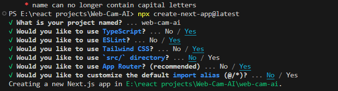
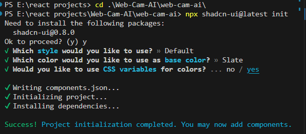

This is a [Next.js](https://nextjs.org/) project bootstrapped with [`create-next-app`](https://github.com/vercel/next.js/tree/canary/packages/create-next-app).

## Getting Started

First, run the development server:

```bash
npm run dev
# or
yarn dev
# or
pnpm dev
# or
bun dev
```

Open [http://localhost:3000](http://localhost:3000) with your browser to see the result.

You can start editing the page by modifying `app/page.tsx`. The page auto-updates as you edit the file.

This project uses [`next/font`](https://nextjs.org/docs/basic-features/font-optimization) to automatically optimize and load Inter, a custom Google Font.

## Learn More

To learn more about Next.js, take a look at the following resources:

- [Next.js Documentation](https://nextjs.org/docs) - learn about Next.js features and API.
- [Learn Next.js](https://nextjs.org/learn) - an interactive Next.js tutorial.

You can check out [the Next.js GitHub repository](https://github.com/vercel/next.js/) - your feedback and contributions are welcome!

## Deploy on Vercel

The easiest way to deploy your Next.js app is to use the [Vercel Platform](https://vercel.com/new?utm_medium=default-template&filter=next.js&utm_source=create-next-app&utm_campaign=create-next-app-readme) from the creators of Next.js.

Check out our [Next.js deployment documentation](https://nextjs.org/docs/deployment) for more details.



`npm run dev` to run the app

- In app/page.tsx remove the code and type `tsrafce` for boiler plate of a component



- Added `button` and `sonner` components from shadcn using ` npx shadcn-ui@latest add button sonner separator` command

# Using Webcam and Canvas to draw a box when a person is detected

- I am going to use a package called `react-webcam` to access webcam.
  `npm install react-webcam`

- Now placing a canvas after webcam setup ` <canvas
  ref={canvasRef}
  className="absolute top-0 left-0 h-full w-full object-contain "
  > </canvas>`

### Shadcn theme setup

- For `theme` using shadcn next-theme
- Install `next-themes`:`npm install next-themes`
- Create a file in `components/theme-provider.tsx` and paste

  ````"use client"; import * as React from "react";
   import { ThemeProvider as NextThemesProvider } from "next-themes"
  import { type ThemeProviderProps } from "next-themes/dist/types"
  export function ThemeProvider({ children, ...props }: ThemeProviderProps) {
  return <NextThemesProvider {...props}>{children}</NextThemesProvider>
  }```

  ````

- Inside `layout.tsx` import `ThemeProvider` and Add the ThemeProvider to your root layout.
  `import { ThemeProvider } from "@/components/theme-provider"`

  ```<ThemeProvider
            attribute="class"
            defaultTheme="system"
            enableSystem
            disableTransitionOnChange
          >
            {children}
          </ThemeProvider>
  ```

- Add a mode toggle
  Place a mode toggle on your site to toggle between light and dark mode.
  create a new file in components/theme-toggle.tsx and paste
  `
  "use client"; import \* as React from "react";
  import { useTheme } from "next-themes";

import { Button } from "@/components/ui/button";
import {
DropdownMenu,
DropdownMenuContent,
DropdownMenuItem,
DropdownMenuTrigger,
} from "@/components/ui/dropdown-menu";
import { MoonIcon, SunIcon } from "lucide-react";

export function ModeToggle() {
const { setTheme } = useTheme();

return (
<DropdownMenu>
<DropdownMenuTrigger asChild>
<Button variant="outline" size="icon">
<SunIcon className="h-[1.2rem] w-[1.2rem] rotate-0 scale-100 transition-all dark:-rotate-90 dark:scale-0" />
<MoonIcon className="absolute h-[1.2rem] w-[1.2rem] rotate-90 scale-0 transition-all dark:rotate-0 dark:scale-100" />
<span className="sr-only">Toggle theme</span>
</Button>
</DropdownMenuTrigger>
<DropdownMenuContent align="end">
<DropdownMenuItem onClick={() => setTheme("light")}>
Light
</DropdownMenuItem>
<DropdownMenuItem onClick={() => setTheme("dark")}>
Dark
</DropdownMenuItem>
<DropdownMenuItem onClick={() => setTheme("system")}>
System
</DropdownMenuItem>
</DropdownMenuContent>
</DropdownMenu>
);
}
`

# Object Detection

- For this feature I am using `Tensorflow.js` from `https://github.com/tensorflow/tfjs-models/tree/master/coco-ssd`
- Install and import following dependencies
  `npm i @tensorflow-models/coco-ssd`
  `npm i @tensorflow/tfjs-backend-cpu`
  `npm i @tensorflow/tfjs-backend-webgl`
  `import * as cocossd from "@tensorflow-models/coco-ssd";
import "@tensorflow/tfjs-backend-cpu";
import "@tensorflow/tfjs-backend-webgl";`
- We have to load this model when our page load or a component load. So we 
